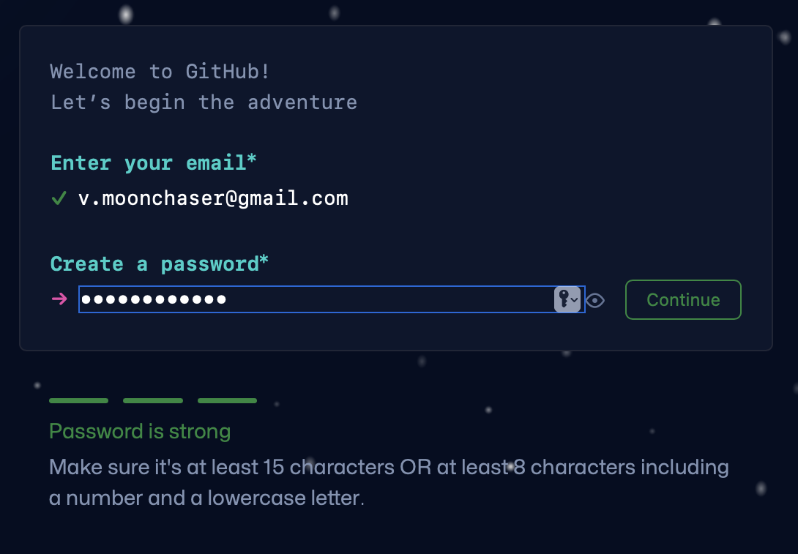

# Create a GitHub Account

1. Go to [GitHub](https://github.com/signup?ref_cta=Sign+up&ref_loc=header+logged+out&ref_page=%2F&source=header-home)

    

1. Use your new professional google accout email.

    

    1. Click the *Continue* Button.

1. Create a password.

    

    1. Click the *Continue* Button.

1. Create your username.

    

    1. Suggestion to use the username you used for your google email.
    1. Remember potential employeers and clients with see this.
    1. Click the *Continue* Button.

1. Answere the question: Would you like to receive product updates and announcements via email?

    

    1. Click the *Continute* Button.

1. Verify your account.

    

    1. Click *Start puzzle* Button.

    

    1. Solve puzzles, get green checkmark for success.

    

    1. Click the *Create account* Button.

    

1. Goto your email account to get the code and enter it in the box provided.

    

1. The intial welcome screen asks a few questions.

    

    1. At the bottom of the page in the center is a *Skip personalization* Button.
    1. Or you may choose to answer the questions. We suggest the following answers:
        1. Question 1: **Just me** 
        1. Question 2: **Student**

1. Congratulations you have made your account!

    

## Next Steps

Explore GitHub using their **API Documentation**.  
1. [Git and GitHub Learning Resources](https://docs.github.com/en/get-started/quickstart/git-and-github-learning-resources).

