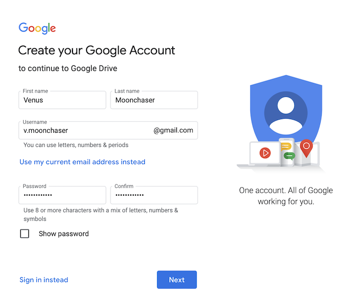
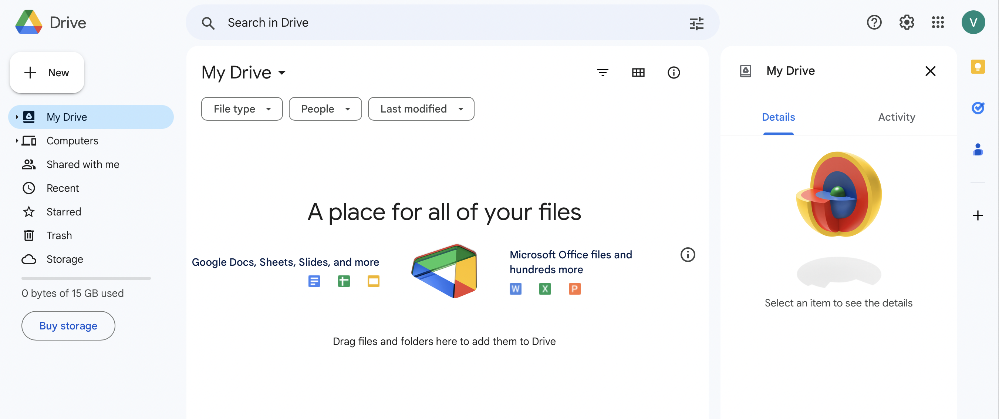

# Create a Profesional Google Account

As you start on your journey to a career in tech, you will need a professional email to use. 

1. Go to [Google.com](https://accounts.google.com/signup/v2/webcreateaccount?continue=https%3A%2F%2Fwww.google.com%2F%3Fclient%3Dsafari&hl=en&biz=false&flowName=GlifWebSignIn&flowEntry=SignUp)

1. Fill in the form where prompted with name, username and password.

    

    1. Suggest some combination of your name, examples for Venus Moonchaser:
        1. FirstNameInitial + LastName = vmoonchaser@gmail.com
        1. FirstName + LastNameInitial = venusm@gmail.com
        1. FirstName + LastName, separated by a period = venus.moonchaser@gmail.com
        1.  FirstNameInitial + LastName, separated by a period = v.moonchaser@gmail.com
    1. If you have a more common name your desired email may not be available.
        1. In this case Google may offer suggestions for you to choose or not choose.
    1. Keep in mind that prospective employers and clients will see this email, if you choose to go a different way.
    1. Click the *Next* Button.

1. Fill in this next form where prompted.

    

    1. Note that phone number and account recovery email are optional.
    1. You must fill in a date of birth and gender.
        1. For more information on why Google collects certain information visit [here](https://support.google.com/accounts/answer/1733224?hl=en).
    1. Click the *Next* Button.

1. Read over Google's Privacy and Terms

    

    1. Click the *Accept* Button.
        1. Located at the bottom of the page when you scroll to read the privacy terms.
 
1. Congratulations you have made your account!

    

## Next Steps

Explore your new Google account using the below links. Developers often provide documentation, references and tutorials on how to use their product. This documentation is **API Documentation**.  This should be your first step when learning new programing languages and software. 

1. [Getting Started](https://support.google.com/accounts/answer/12372353?sjid=18085989500893463227-NA&visit_id=638167341292983984-3652906596&rd=1).
1. [Google Workspace Learning Center](https://support.google.com/a/users/answer/9389764?hl=en&ref_topic=9296556&sjid=2843538229769012192-NA)